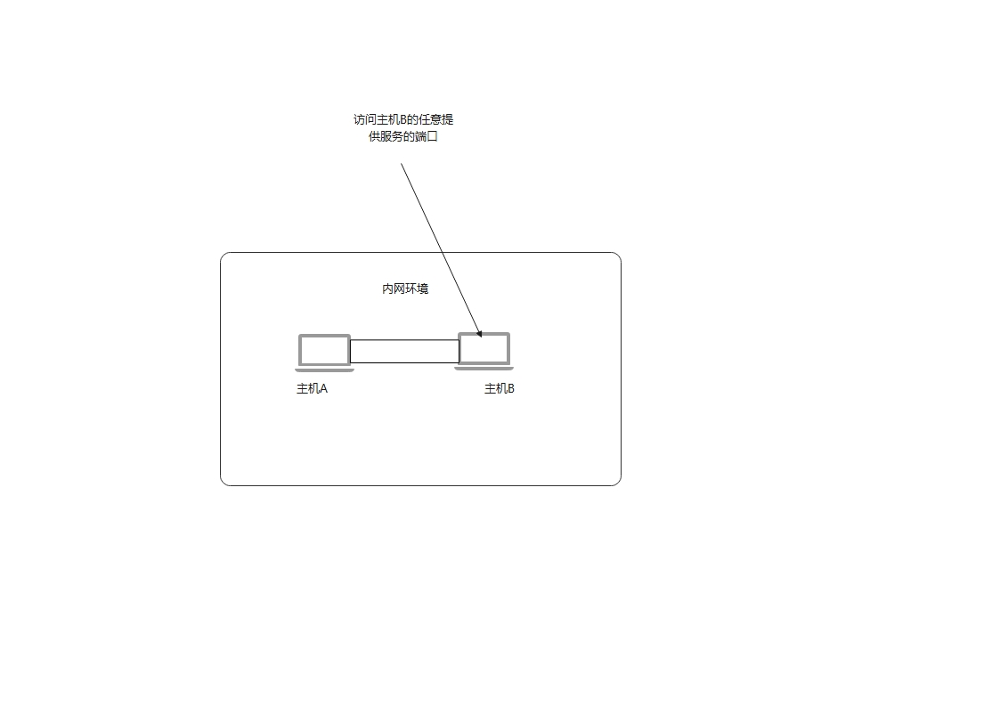
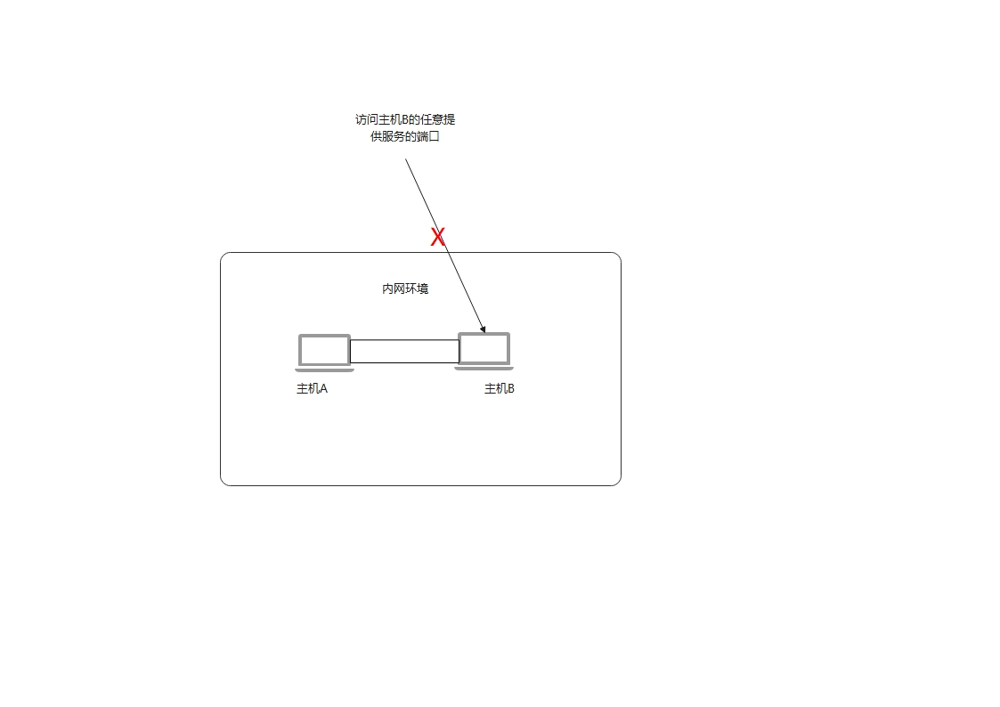
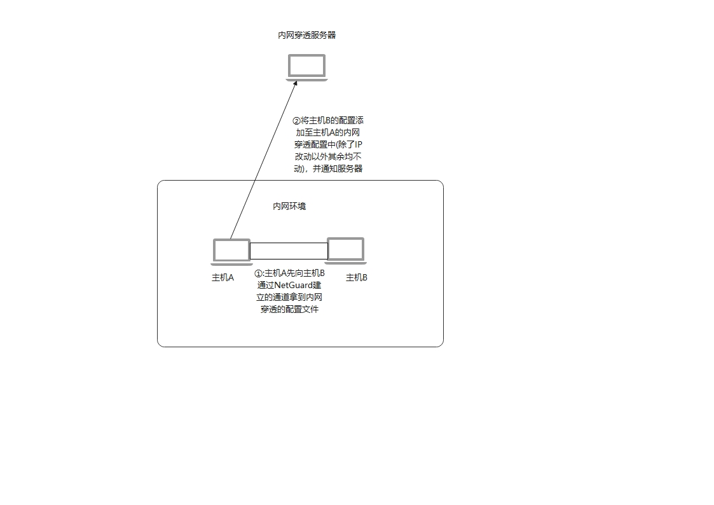
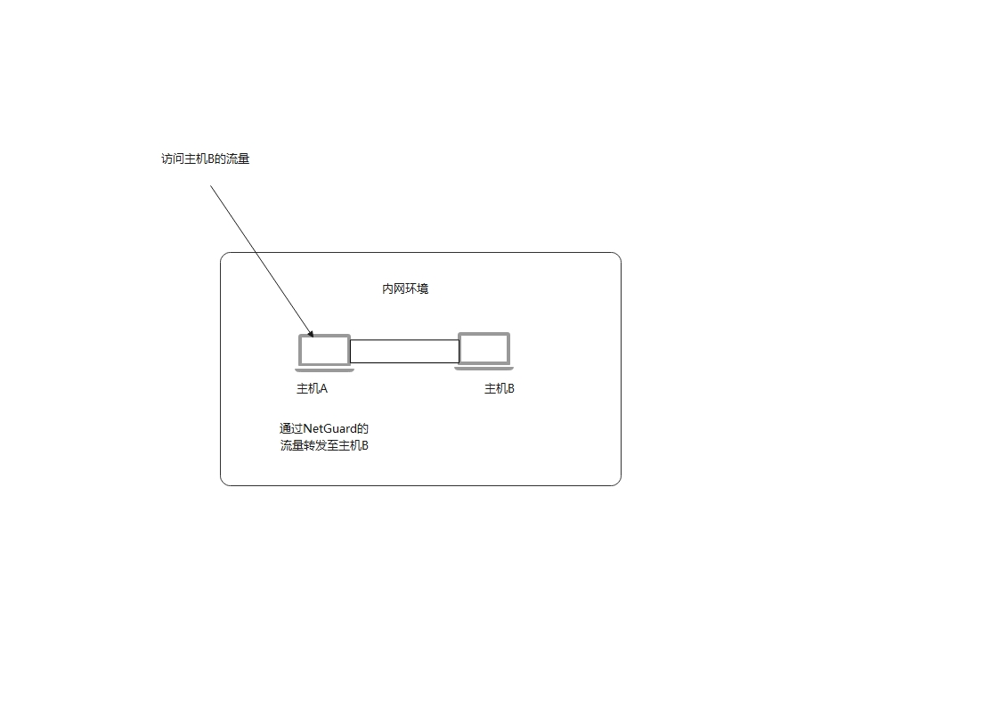

# NetGuard
## 内网穿透中主机掉线但服务不掉线的解决方案

### 概述:

作者实际遇见的情况

因为云服务器性价比不如实际的主机高，但又想搭建几个对服务器性能要求较高的应用(如图床，数据库等)，于是就买了几台迷你主机
加上一些固态，打算在内网中搭建一套分布式的系统，然后外网可以访问(外网使用服务器+frp内网穿透方案)

正常情况下:

出现异常:

即网络问题导致的掉线

运作逻辑:

然后因为主机是通过WiFi来和外网进行连接的，加上主机网卡确实很奇怪不知道为什么会偶尔断线，导致访问有时候会断线，但人不在
家中没办法手动重启/手动重连WiFi，所以为了解决这个问题，有了如下的项目

